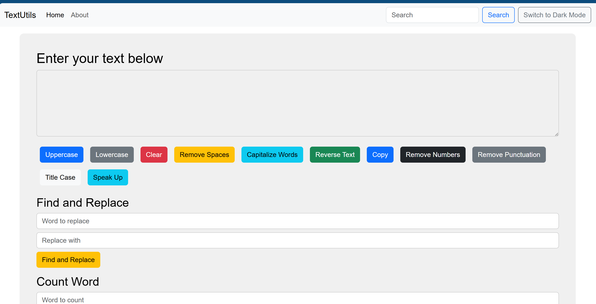
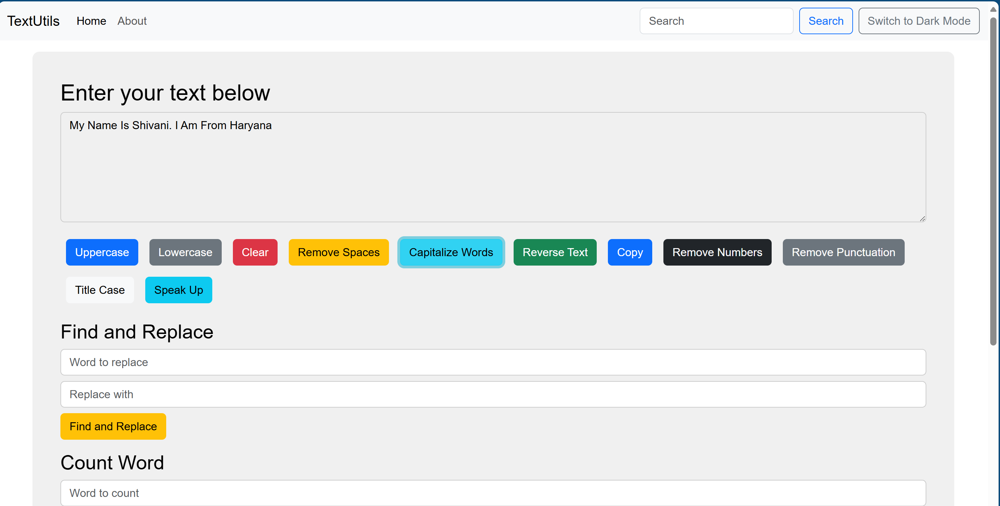
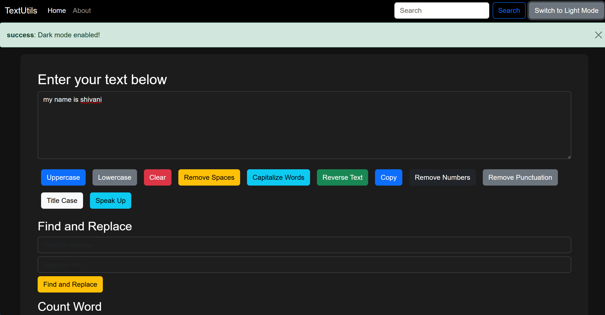
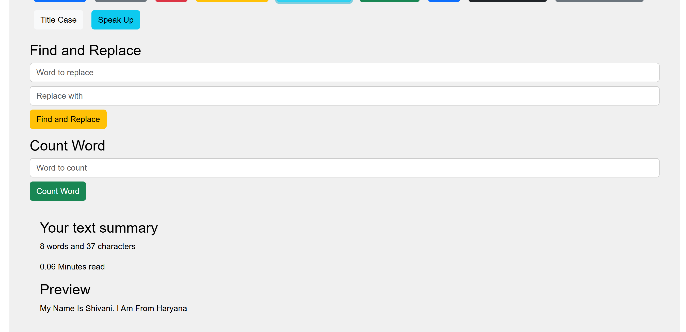

# Word Counter App

## 📌 Overview
The Word Counter App is a simple yet powerful tool built with **React, Bootstrap, HTML, CSS, and JavaScript**. It helps users analyze text by counting words, characters, removing extra spaces, and more.

---

## 🚀 Features
- ✅ **Word & Character Count**
- ✅ **Convert Text to Uppercase/Lowercase**
- ✅ **Remove Extra Spaces & Numbers**
- ✅ **Capitalize First Letter**
- ✅ **Speak-up Feature**
- ✅ **Paragraph Summarization**

---

## 🖼 Screenshots

📌 **Home Page**  
  

📌 **Text Analysis Section**  
  

📌 **Theme Toggle Feature**  

  

📌 **Speak-Up & Summary Feature**  
  

---

## 🔧 Installation & Usage

1️⃣ Clone the repository  
```sh
git clone https://github.com/your-username/word-counter-app.git
cd word-counter-app
